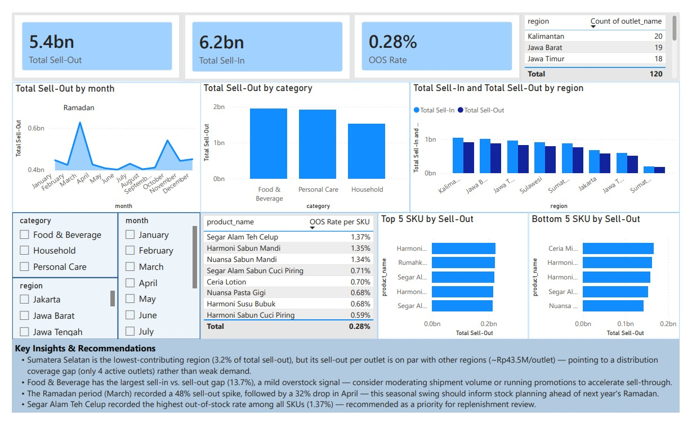

# 🛒 FMCG Sales & Distribution Performance Analysis

A dummy end-to-end data analytics project simulating a real-world Sales & Trade Marketing analysis for an FMCG company — built with **SQL**, **Excel**, and **Power BI**.

> ⚠️ **Note:** All data in this project is synthetic/dummy, generated for portfolio purposes. It does not represent any real company's data.

---

## 🏢 Business Background

I stepped into the role of a **Data/BI Analyst** at the Sales & Trade Marketing division of a fictional FMCG company, **Nusantara Consumer Goods** — producing Personal Care, Food & Beverage, and Household products distributed across 8 regions in Indonesia.

Management wanted a clearer picture of **overall sales performance across categories, regions, and time**, and specifically flagged a concern: certain regions appeared to be **underperforming**, and it wasn't clear whether this was a **distribution** problem or a **demand** problem.

## ❓ Business Questions

1. Which product categories and regions contribute the most (and least) to overall sell-out?
2. Is the underperformance in weaker regions driven by **distribution coverage** (number of active outlets) or by **demand**?
3. Which categories show the largest gap between sell-in and sell-out (a signal of potential overstock)?
4. Which SKUs are most frequently out of stock, and where should replenishment be prioritized?

## 🛠️ Tools Used

| Tool | Purpose |
|---|---|
| 🗄️ **SQL** (SQLite via DB Browser) | Data modeling, joins, and analytical queries |
| 📊 **Excel** | Pivot tables, KPI calculations, conditional formatting, executive summary |
| 📈 **Power BI** | Interactive dashboard and data storytelling |
| 🐍 **Python** | Synthetic dummy data generation |

## 🔄 Workflow

1. **Data Generation** — Synthetic FMCG transaction data generated with Python (`scripts/dummy_data.py`), producing 5 relational tables (star schema: 1 fact table + 4 dimension tables).
2. **SQL** — Data loaded into SQLite; 5 analytical queries built to answer the business questions (`sql/analysis_queries.sql`), plus a joined query to prepare a flat table for Excel/Power BI (`sql/query_for_excel.sql`).
3. **Excel** — Pivot tables, manual KPI calculations (market share, MoM growth, out-of-stock rate), conditional formatting, and an executive summary sheet.
4. **Power BI** — A single-page interactive dashboard combining KPI cards, trend analysis, regional breakdowns, and SKU-level deep dives.

## 📊 Dashboard Preview



## 💡 Key Insights & Recommendations

- 📍 **Sumatera Selatan** is the lowest-contributing region, generating only **3.2%** of total sell-out — but its sell-out **per active outlet** is on par with other regions (~Rp43.5M/outlet). This points to a **distribution coverage gap** (only 4 active outlets vs. 11-20 in other regions) rather than weak demand — recommend prioritizing outlet expansion here next quarter.
- 🍫 **Food & Beverage** has the largest sell-in vs. sell-out gap (13.7%), a mild signal of overstock risk — recommend moderating shipment volume or running promotions to accelerate sell-through.
- 🌙 The **Ramadan period (March)** recorded a **48%** sell-out spike compared to the previous month, followed by a **32%** drop in April — this seasonal swing should inform stock planning ahead of next year's Ramadan.
- 📦 **Segar Alam Teh Celup** recorded the highest out-of-stock rate among all SKUs (**1.37%**) — recommended as a priority for replenishment review.

## 📁 Repository Structure
```
├── data/       → Dummy dataset (CSV) — dimension & fact tables
├── scripts/    → Python script for synthetic data generation
├── sql/        → SQL queries (analysis + data prep for Excel/Power BI)
├── excel/      → Excel workbook (pivot tables, KPI, executive summary)
└── powerbi/    → Power BI dashboard (.pbix) + preview screenshot
```
---

📌 *This project was built as part of my data analyst / BI analyst portfolio. Feel free to explore the files above for the full workflow.*
